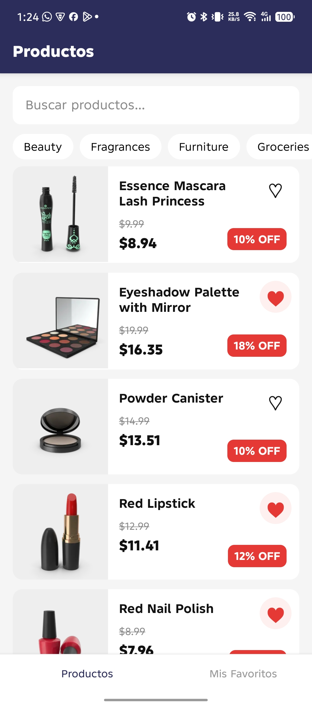
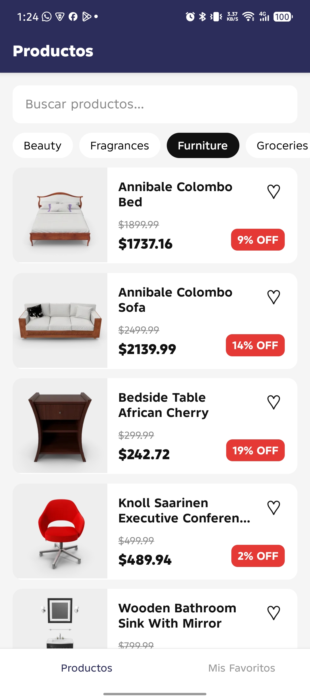

# Aplicación MiniMarket con React Native

Aplicación para prueba técnica desarrollada en React Native CLI.
La aplicación permite: consultar productos, buscar productos, filtrar por categoría, ver detalle de producto, añadir/eliminar de favorito

## Stack

- React Native CLI 0.81.6
- React 19
- TypeScript
- React Navigation 7
- TanStack Query
- Zustand
- MMKV
- Axios
- React Native Reanimated
- Jest
- React Native Testing Library
- ESLint
- Prettier

## Es necesario tener:

- Node.js 20+
- npm
- React Native CLI
- Android Studio + Android SDK para Android
- Xcode para iOS
- Ruby
- CocoaPods
- JDK compatible con React Native 0.81

## Instalación

```bash
#Clonar el repositorio:
git clone https://github.com/wilberparedes/mini-market-rn.git

cd MiniMarketRN


# instalar dependencias
npm install

# Crear el archivo .env en la raíz:
yarn start
```

### Android

```sh
#Iniciar metro
npm start

#Correr android en otra terminal
npm run android
```

### iOS

```sh
#Instalar dependencias
cd ios
bundle install
bundle exec pod install
cd ..

#Iniciar metro
npm start

#Correr ios en otra terminal
npm run ios
```

### Test

Se utilizó _Jest_ + _React Native Testing Library_.

```sh
#Para ejecutar test
npm test
```

En esta ocación se realizaron test que cubren temas como: renderizado e interacción de productos, gestión de favoritos, comportamiento de la hook useProducts, entre otros.

### Validar Calidad de código

```sh
#Para ejecutar ESLint
npm run lint

#Para verificar formato
npm run lint:format

#Para formatear código
npm run format
```

## Arquitectura

La aplicación se desarrolló bajo una arquitectura, por capas y separando las responsabilidades entre:

- api: Cliente HTTP y servicios API.
- components: Componentes reutilizables.
- config: Configuración general y variables de entorno.
- domain: Modelos y tipos de dominio.
- hooks: Hooks reutilizables.
- navigation: Navegación y tipos.
- screens: Pantallas.
- storage: Persistencia local.
- store: Estado global.
- native: Módulos nativos.
- utils: Funciones de utilizades reutilizables.

```sh
#Para ejecutar ESLint
npm run lint

#Para verificar formato
npm run lint:format

#Para formatear código
npm run format
```

## TypeScript

El proyecto se desarrolló 100% en TypeScript con su respectivo

```json
"strict": true
```

## Estado

Se utilizó _TanStack Query_ debido a las ventajas que ofrece a nivel del manejo de errores e interacción en la carga, exponiendo para así tener acceso facilmente a: Loading states, errores, caché, refetch, paginación/infinite scroll, cancelación de requests.

### Global

En este caso se utilizó _Zustand_ debido a que al tener un store no muy complejo y a lo rapido que se puede utilizar esta dependencia, nos ayuda a tener una buena configuración rápida, al no tener tratamiento muy complejo con el estado, era la mejor solución y la más rápida para este caso.

### Persistencia

Se utilizó _MMKV_ ya que en la actualidad es el que mejor se comporta, aunque en este caso se necesitó de configuraciones extras, debido a la versión de RN utilizada, tales como activar la nueva arquitectura de RN, instalar la versión exacta de react-native-nitro _(npm install react-native-nitro-modules@0.37.1 --save-exact)_

## Navegación

Se utilizó React Navigation 7 con:

- Bottom Tab Navigator.
- Native Stack Navigator anidado.
  Los parámetros de navegación están tipados mediante TypeScript.

```Javascript
export type RootTabParamList = {
  ProductsStack: undefined;
  Favorites: undefined;
};

type Props = NativeStackScreenProps<ProductsStackParamList, 'Products'>;
```

## Módulos nativos

Con fines educativos y de demostrar el conocimiento en la creación de Módulos nativos, por lo cual se construyó un pequeño módulo para el formateo de moneda. Estos módulos fueron implementados para Android/ios y se exponen mediante bridge por javascript.

## API

Se utiliza Axios sobre `fetch` para centralizar la comunicación HTTP en un único cliente.

La decisión permite:

- Configurar una URL base mediante variables de entorno.
- Centralizar el manejo de errores HTTP.
- Mantener una interfaz consistente para los servicios de API.
- Utilizar `AbortController` para cancelar peticiones cuando corresponde.

La capa de API está desacoplada de las pantallas y componentes

## Manejo de errores

Los errores de red se manejaron explícitamente desde la capa de API y se muestran estados apropiados en la interfaz.

La aplicación contempló:

- Loading.
- Error.
- Retry.
- Empty states.
- Cancelación de requests.

También se incorporó un Error Boundary global para evitar que un error inesperado deje la aplicación sin una interfaz recuperable.

### Rendimiento

Se utilizó _FlatList_ para renderizar listas de productos y evitar montar todos los elementos simultáneamente

Se implementó:

- _keyExtractor_ estable basado en el ID del producto.
- _initialNumToRender_.
- _maxToRenderPerBatch_.
- _windowSize_.
- _removeClippedSubviews_.
- Infinite scroll mediante _onEndReached_.

Para las imágenes se utilizó la caché disponible en el componente _Image_ de React Native, que nos ayuda bastante bien con lo requerido y así evitamos descargas innecesarias cuando la imagen ya está disponible en caché.

_React.memo_ se utilizó en componentes reutilizables de lista para evitar renders innecesarios cuando sus props no cambian.

_useCallback_ se utilizó para mantener referencias estables en callbacks enviados a componentes y _FlatList_.

_useMemo_ se utilizó únicamente para cálculos derivados cuyo resultado puede reutilizarse entre renders.

## Funcionalidades principales

### Productos

- Listado mediante FlatList.
- Infinite scroll.
- Búsqueda con debounce.
- Filtrado por categoría.
- Pull to refresh.
- Estados de loading/error.
- Favoritos.
- Optimización del renderizado.

### Detalle

- Información completa del producto.
- Carrusel de imágenes.
- Precio original.
- Precio con descuento.
- Rating.
- Tags.
- Gestión de favoritos.
- Animaciones con Reanimated.

### Favoritos

- Persistencia local.
- Estado reactivo.
- Eliminación de favoritos.
- Empty state.

## Capturas

### Video de demo


### Splash


### Productos



### Categorías



### Detalle de Producto


### Guardado como favorito


## CI

Se realizó una pequeña integración de GitHub Actions que incluye un workflow que hace:

- Instalar dependencias.
- Validar ESLint.
- Verificar Prettier.
- Ejecutar Test (Quality).

## Extras

También se implementó Skeleton, Accesibilidad

## Autor

Wilber Paredes :) 👍
